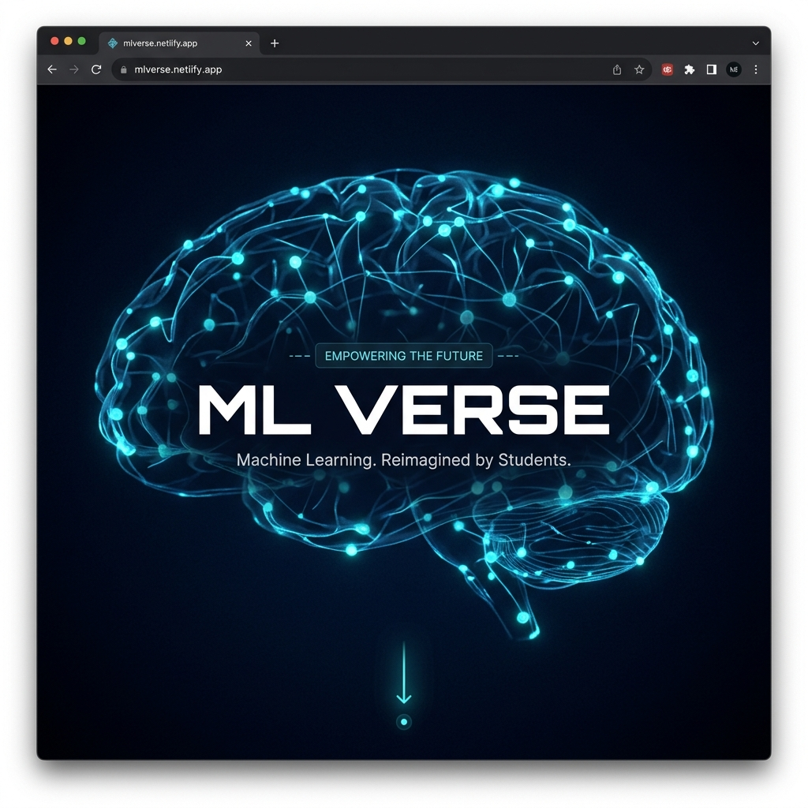
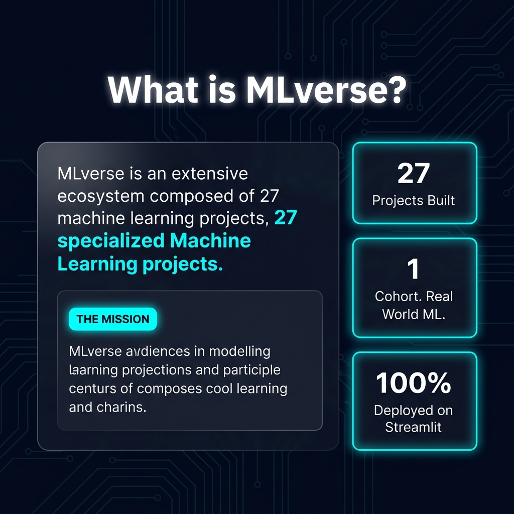
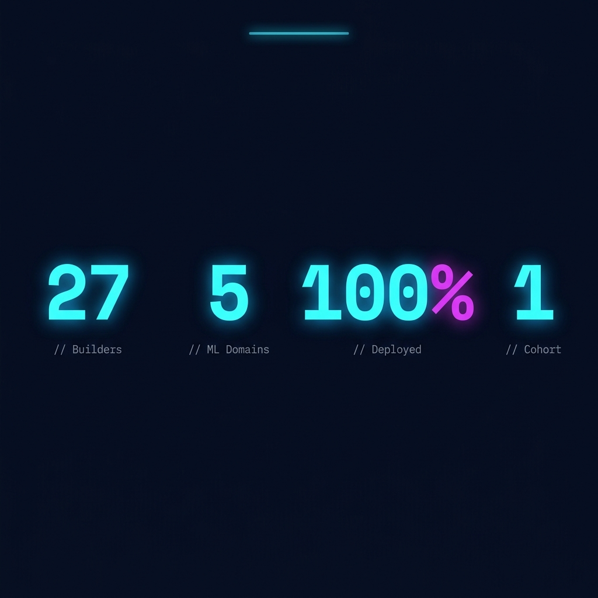
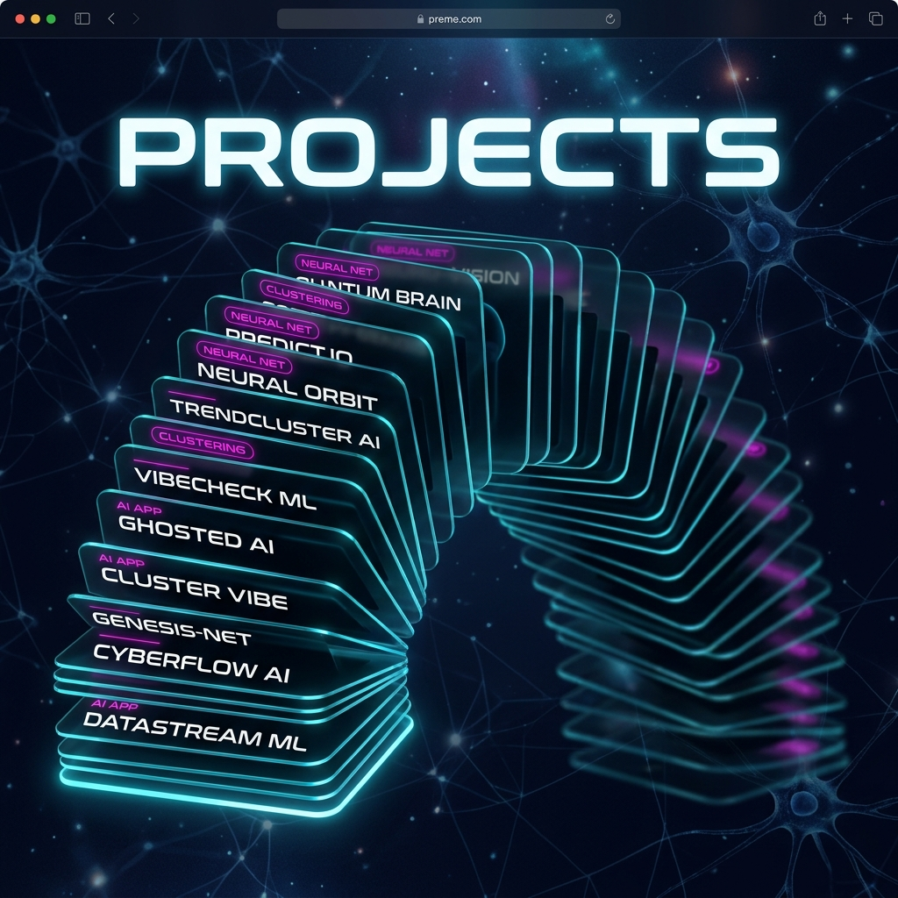
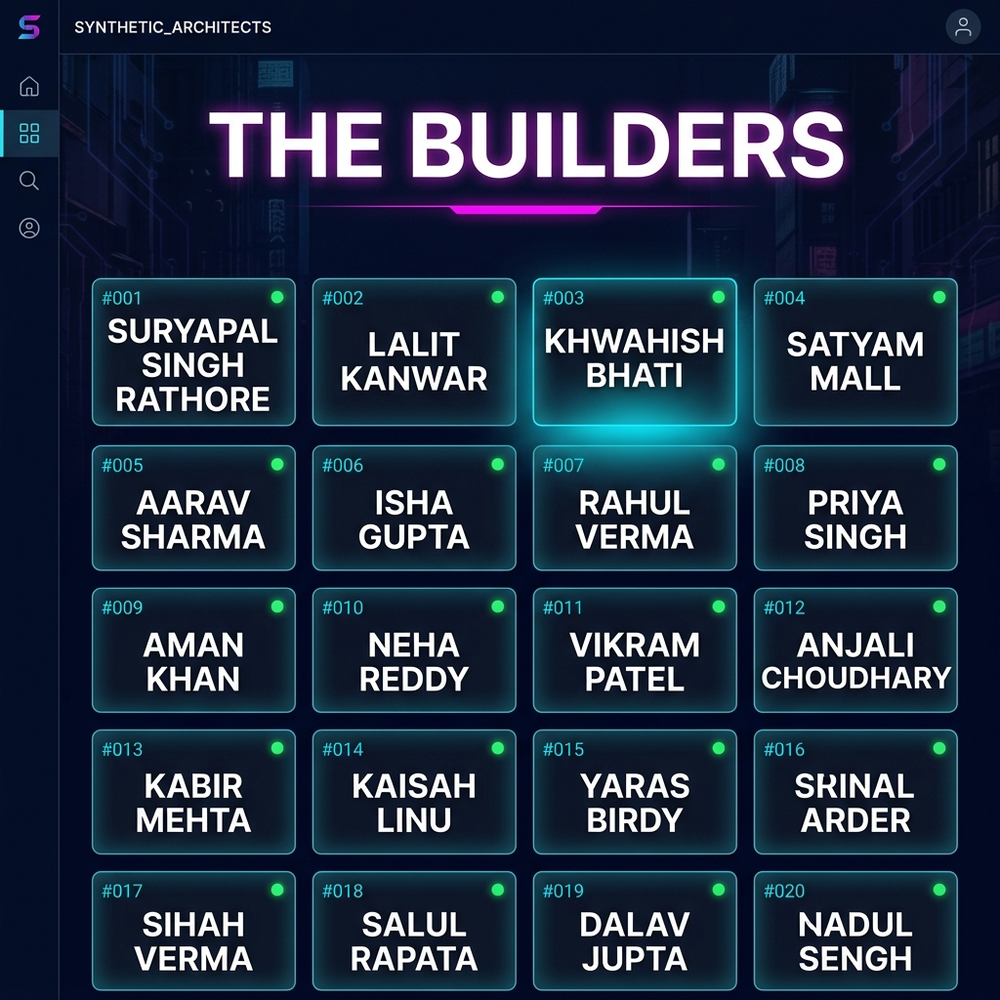
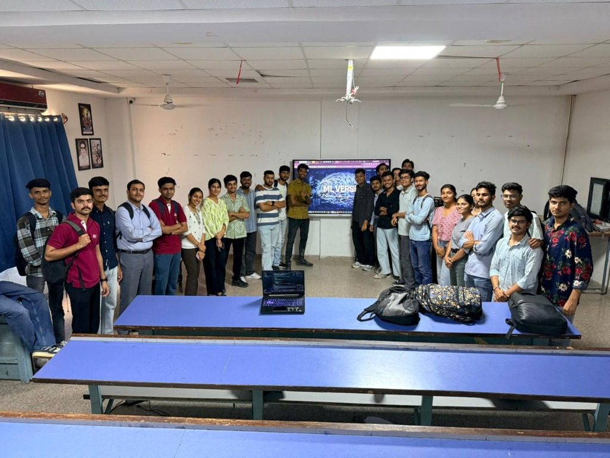

<div align="center">

# ⚡ MLverse



<!-- Badges -->


<br/>

> **Machine Learning. Reimagined by Students.**
> 
> MLverse is a cinematic, scroll-driven showcase of 27 real-world Machine Learning applications — each built, deployed, and owned by students of **SIN School of AI** under **SIN Education & Technology Pvt. Ltd.**

<br/>

[](https://mlverse.netlify.app)

</div>

---

## 📸 Screenshots

<table>
  <tr>
    <td align="center" width="50%">
      
      <br/><sub><b>🎬 Hero — 3D Brain Scroll Animation</b></sub>
    </td>
    <td align="center" width="50%">
      
      <br/><sub><b>🔭 About — What is MLverse?</b></sub>
    </td>
  </tr>
  <tr>
    <td align="center" width="50%">
      
      <br/><sub><b>📊 Stats — Animated Counters</b></sub>
    </td>
    <td align="center" width="50%">
      
      <br/><sub><b>🗂️ Projects — 27 ML Apps, Live & Deployed</b></sub>
    </td>
  </tr>
  <tr>
    <td align="center" colspan="2">
      
      <br/><sub><b>👥 The Builders — Every Builder. Every Project.</b></sub>
    </td>
  </tr>
  <tr>
    <td align="center" colspan="2">
      
      <br/><sub><b>🚀 Cohort 01 — MLverse Launch Day at SIN School of AI</b></sub>
    </td>
  </tr>
</table>

---

## 🧠 What is MLverse?

MLverse is a sprawling digital ecosystem of **27 specialized Machine Learning projects**, each built with precision and deployed to solve real-world problems. From deep neural networks to advanced clustering algorithms, this universe represents the pinnacle of AI innovation at **SIN School of AI**.

> **THE MISSION** — To bridge the gap between complex ML theory and functional, deployable applications that anyone can use.

### Key Highlights

- 🎬 **Cinematic Scroll Experience** — 40-frame 3D brain animation driven by GSAP ScrollTrigger
- 🃏 **Deck of Cards UI** — Projects presented as an interactive 3D card stack
- ⚡ **Animated Counters** — Stats count up live as you scroll past them
- 👥 **Builder Profiles** — Click any builder to see their projects in a glassmorphism modal
- 🌌 **Lenis Smooth Scroll** — Buttery 60fps scroll throughout the entire page
- 🎨 **Glassmorphism Design** — Dark navy + cyan + magenta cyberpunk aesthetic
- 📱 **Fully Responsive** — Mobile-first, works on all screen sizes

---

## 🚀 Tech Stack

| Layer | Technology |
|---|---|
| **Frontend Framework** | React 18 + Vite 4 |
| **Animation Engine** | GSAP 3.12 (ScrollTrigger, Timelines) |
| **Motion Library** | Framer Motion 12 |
| **Smooth Scroll** | Lenis 1.3 |
| **3D Brain BG** | Canvas API (40-frame JPG sequence) |
| **HTTP Client** | Axios |
| **Styling** | Vanilla CSS + CSS Variables |
| **Fonts** | Rajdhani, Space Mono (Google Fonts) |
| **Build Tool** | Vite (ES Modules) |
| **Backend** | Node.js + Express (local dev only) |
| **Deployment** | Netlify (static hosting) |
| **Project Hosting** | Streamlit Cloud |

---

## 🗂️ All 27 Projects

| # | Project Name | Builder | Type | Live Link |
|---|---|---|---|---|
| 01 | TrendCluster AI | Suryapal Singh Rathore | `Clustering` | [🔗 Open](https://clustering-8grahwa2svom3acvbufcj9.streamlit.app/) |
| 02 | Random Forest | Lalit Kanwar | `Classification` | [🔗 Open](https://randomforest-ttqrpseauduxkxiz78ltel.streamlit.app/) |
| 03 | Clustering Analysis | Khwahish Bhati | `Clustering` | [🔗 Open](https://clusteringanalysis-eyrixzttks47yhcdx2mysu.streamlit.app/) |
| 04 | Random Forest | Tanishq | `Classification` | [🔗 Open](https://randomforest-ttqrpseauduxkxiz78ltel.streamlit.app/) |
| 05 | GhostedAI | Satyam Mall | `AI App` | [🔗 Open](https://ghostedai999.streamlit.app/) |
| 06 | GhostedAI | Satyam Deora | `AI App` | [🔗 Open](https://ghostedai999.streamlit.app/) |
| 07 | ClusterVibe: AI Segmenter | Shreyanshi Jangid | `Clustering` | [🔗 Open](https://clustervibe.streamlit.app/) |
| 08 | Machine Learning App | Mansi Soni | `ML App` | [🔗 Open](https://machine-learning-npzzshyytnx89xmqhapayy.streamlit.app/) |
| 09 | VibeCheck ML | Ridhima Agarwal | `AI App` | [🔗 Open](https://vibecheck001.streamlit.app/) |
| 10 | Activation Model | Kritesh Singh Chouhan | `Neural Net` | [🔗 Open](https://activation-model-8t6bgb5lqvg8zwnulim968.streamlit.app) |
| 11 | ClusterVerse | Himanshu Bhandari | `Clustering` | [🔗 Open](https://clusterverse-afathytjikzwzjtqkyrbhu.streamlit.app/) |
| 12 | Random Forest | Harish | `Classification` | [🔗 Open](https://randomforest-ttqrpseauduxkxiz78ltel.streamlit.app/) |
| 13 | ML Acti. Pro. | Nikhil Sharma | `Neural Net` | [🔗 Open](https://ml-acti-pro-pvq2kxzs8ojhv2qnvtqmy3.streamlit.app/) |
| 14 | Learn ML Arctic Ultimate | Mayank Solanki | `Neural Net` | [🔗 Open](https://activation-model-8t6bgb5lqvg8zwnulim968.streamlit.app) |
| 15 | ML Clustering | Aniket Daiya | `Clustering` | [🔗 Open](https://ml-clustering-npt5ms4wcpjtvbqgigkwmr.streamlit.app/) |
| 16 | Learn ML Arctic Ultimate v2 | Kritesh Singh Chouhan | `Neural Net` | [🔗 Open](https://activation-model-83tbjhtkdhhnpbry53kwxi.streamlit.app) |
| 17 | Clustering Analysis | HarshWardhan Singh Jodha | `Clustering` | [🔗 Open](https://clusteringanalysis-eyrixzttks47yhcdx2mysu.streamlit.app/) |
| 18 | Clustering Analysis | Arvind Bishnoi | `Clustering` | [🔗 Open](https://clusteringanalysis-eyrixzttks47yhcdx2mysu.streamlit.app/) |
| 19 | Classification | Jaswardhan Solanki | `Classification` | [🔗 Open](https://classificationgit-b95gecbrljdkbn9ryqhbe7.streamlit.app/) |
| 20 | Activation Dashboard | Priyansh Rai | `Neural Net` | [🔗 Open](https://activation-dashboard-lb2r65ed4yrwzwzj7sbdse.streamlit.app) |
| 21 | Clustering Dashboard | Su_kumawat (Sunil) | `Clustering` | [🔗 Open](https://clustering-dashboard-sunil.streamlit.app/) |
| 22 | Activation Functions | Anonymous | `Neural Net` | [🔗 Open](https://activation-fun-dmuemtinpjrfdonvkdni9t.streamlit.app/) |
| 23 | Stock Market AI | Udit Jain | `ML App` | 🚧 Coming Soon |
| 24 | AIGoverse | Shakti Singh | `AI App` | 🚧 Coming Soon |
| 25 | NeuralOrbit | Khushal Khatri | `ML Library` | [🔗 Open](https://neuralorbit.streamlit.app/) |
| 26 | Activation Function | Neeti Lohiya | `Neural Net` | [🔗 Open](https://activationfunctionn.netlify.app) |
| 27 | OpenRouter Explorer | Ritesh Mane | `AI App` | [🔗 Open](https://riteshmane-2005-homework-openrouter-explorerapp-iko7za.streamlit.app/) |

---

## 👥 The Builders

> Every project is built by a real student — not a template, not a tutorial copy, but a live, deployed ML application.

<table>
  <tr>
    <td>👤 Suryapal Singh Rathore</td>
    <td>👤 Lalit Kanwar</td>
    <td>👤 Khwahish Bhati</td>
    <td>👤 Tanishq</td>
  </tr>
  <tr>
    <td>👤 Satyam Mall</td>
    <td>👤 Satyam Deora</td>
    <td>👤 Shreyanshi Jangid</td>
    <td>👤 Mansi Soni</td>
  </tr>
  <tr>
    <td>👤 Ridhima Agarwal</td>
    <td>👤 Kritesh Singh Chouhan</td>
    <td>👤 Himanshu Bhandari</td>
    <td>👤 Harish</td>
  </tr>
  <tr>
    <td>👤 Nikhil Sharma</td>
    <td>👤 Mayank Solanki</td>
    <td>👤 Aniket Daiya</td>
    <td>👤 HarshWardhan Singh Jodha</td>
  </tr>
  <tr>
    <td>👤 Arvind Bishnoi</td>
    <td>👤 Jaswardhan Solanki</td>
    <td>👤 Priyansh Rai</td>
    <td>👤 Su_kumawat (Sunil)</td>
  </tr>
  <tr>
    <td>👤 Udit Jain</td>
    <td>👤 Shakti Singh</td>
    <td>👤 Khushal Khatri</td>
    <td>👤 Neeti Lohiya</td>
  </tr>
  <tr>
    <td>👤 Ritesh Mane</td>
    <td colspan="3"></td>
  </tr>
</table>

---

## 📁 Project Structure

```
mlverse/
├── client/                     # React frontend (Vite)
│   ├── public/
│   │   ├── frames/             # 40 JPG frames for 3D brain scroll animation
│   │   │   └── ezgif-frame-001.jpg … ezgif-frame-040.jpg
│   │   └── brain.gif           # Fallback brain GIF
│   ├── src/
│   │   ├── components/
│   │   │   ├── BrainAnimation.jsx     # 3D brain canvas renderer
│   │   │   ├── CanvasScroll.jsx       # GSAP scroll-driven frame animation
│   │   │   ├── CircuitPattern.jsx     # SVG circuit board background
│   │   │   ├── Cursor.jsx             # Custom animated cursor
│   │   │   ├── Footer.jsx             # Footer with scanlines effect
│   │   │   ├── Loader.jsx             # Loading screen
│   │   │   ├── Navbar.jsx             # Navigation bar
│   │   │   ├── NeuralBackground.jsx   # Animated neural particle field
│   │   │   ├── ProjectCard.jsx        # 3D tilt project card
│   │   │   ├── ScrollProgress.jsx     # Scroll progress indicator
│   │   │   └── StatCard.jsx           # Glassmorphism stat card
│   │   ├── data/
│   │   │   ├── projectsData.js        # All 27 projects (client-side fallback)
│   │   │   └── typeColors.js          # ML type → color mapping
│   │   ├── hooks/
│   │   │   └── useProjects.js         # Data fetching hook with fallback
│   │   ├── sections/
│   │   │   ├── Hero.jsx               # Landing screen with 3D brain
│   │   │   ├── About.jsx              # MLverse overview + stat cards
│   │   │   ├── Stats.jsx              # Animated counter section
│   │   │   ├── Projects.jsx           # Deck of cards project browser
│   │   │   ├── Team.jsx               # Builder grid with modals
│   │   │   └── Connect.jsx            # Contact/connect section
│   │   ├── App.jsx
│   │   ├── main.jsx
│   │   └── index.css                  # Global CSS variables & tokens
│   ├── dist/                          # Production build (deploy this to Netlify)
│   └── package.json
├── server/                     # Node.js + Express (local dev API)
│   ├── data/
│   │   └── projects.js         # Projects JSON data
│   └── index.js                # Express API server (port 5000)
├── screenshots/                # App preview screenshots
└── README.md
```

---

## 🏃 Running Locally

### Prerequisites

- Node.js v20+
- npm v8+

### 1. Clone the repository

```bash
git clone https://github.com/your-username/mlverse.git
cd mlverse
```

### 2. Start the frontend

```bash
cd client
npm install
npm run dev
```

App runs at → **http://localhost:5173**

### 3. (Optional) Start the backend API

```bash
cd server
npm install
node index.js
```

API runs at → **http://localhost:5000/api/projects**

> **Note:** The frontend has a built-in client-side data fallback. The backend is optional — the app works fully without it.

---

## 🌐 Deploying to Netlify

The app is fully static. Deploy with a single drag-and-drop:

1. Build the project:
   ```bash
   cd client
   npm run build
   ```

2. Go to [netlify.com/drop](https://netlify.com/drop)

3. Drag-and-drop the **`client/dist/`** folder

The `_redirects` file inside `dist/` handles SPA routing automatically. All 40 brain frames, the GIF, logos — everything is bundled inside `dist/`.

---

## 📊 ML Domains Covered

| Domain | Badge | Projects |
|---|---|---|
| Clustering |  | TrendCluster, ClusterVibe, ClusterVerse, ML Clustering, Clustering Dashboard... |
| Classification |  | Random Forest (×3), Classification App |
| Neural Networks |  | Activation Model, ML Acti Pro, Learn ML Arctic, Activation Dashboard... |
| AI Applications |  | GhostedAI, VibeCheck ML, AIGoverse, OpenRouter Explorer... |
| ML Libraries/Apps |  | Machine Learning App, Stock Market AI, NeuralOrbit |

---

## 🏛️ Authority & Organisation

<div align="center">

| | |
|---|---|
| **Institution** | SIN School of AI |
| **Organisation** | SIN Education & Technology Pvt. Ltd. |
| **Cohort** | Batch 1 — The Founding Builders |
| **Deployment** | 100% Live on Streamlit Cloud & Netlify |

</div>

---

## 📜 License

```
MIT License — © 2025 SIN School of AI · SIN Education & Technology Pvt. Ltd.
```

All individual projects are owned by their respective student builders.  
The MLverse showcase platform is open-source under MIT.

---

<div align="center">

**Built with ❤️ by the students of SIN School of AI**


*"Every line of code is a step into the MLverse."*

</div>
