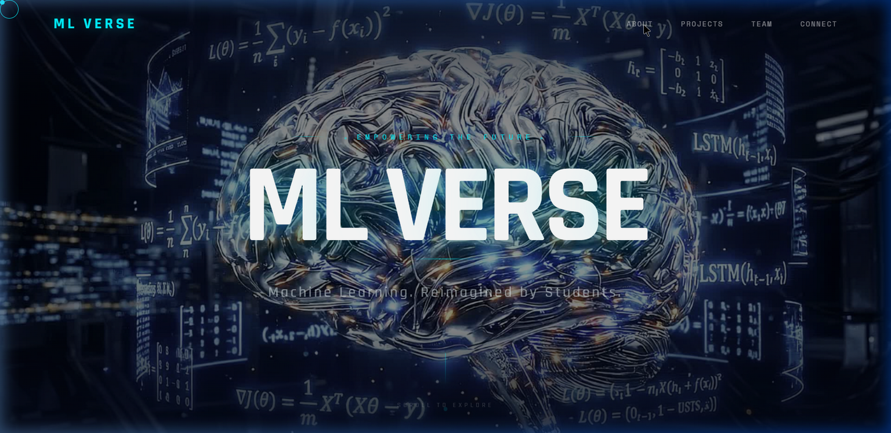
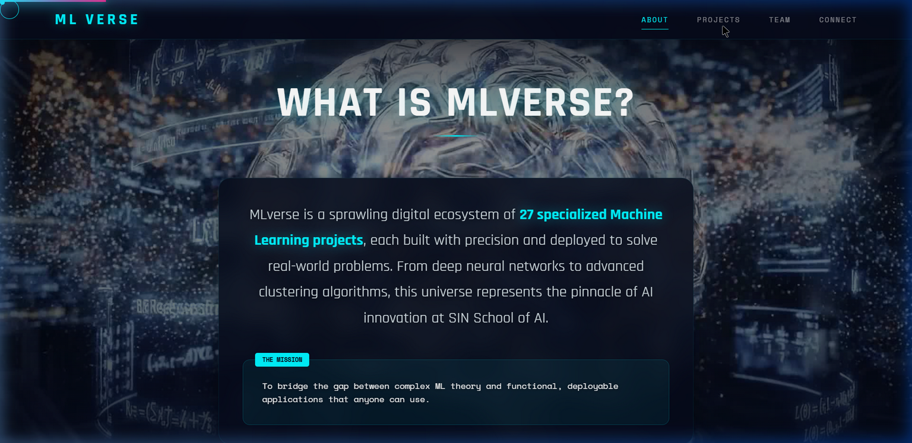
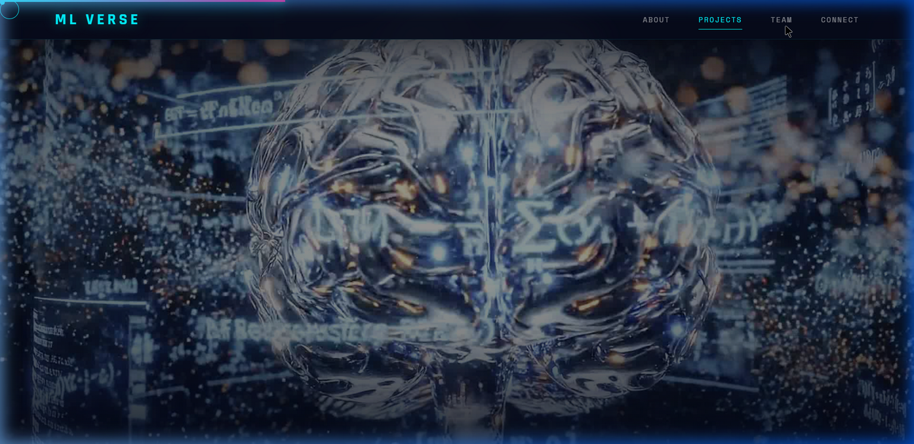
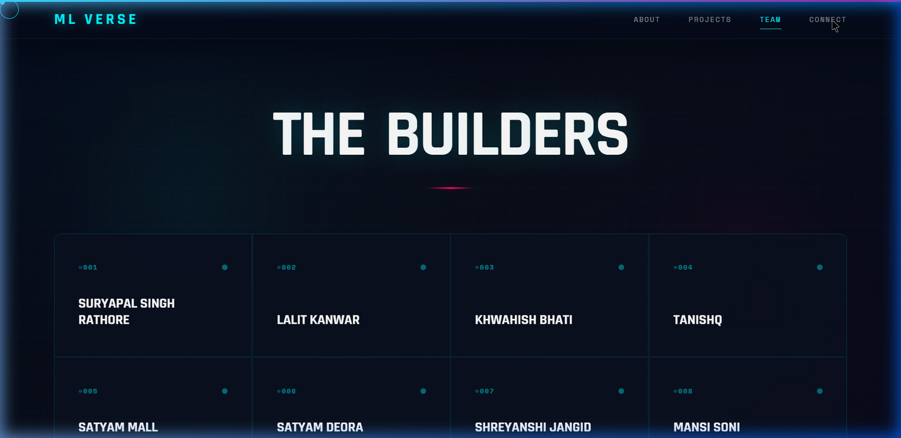
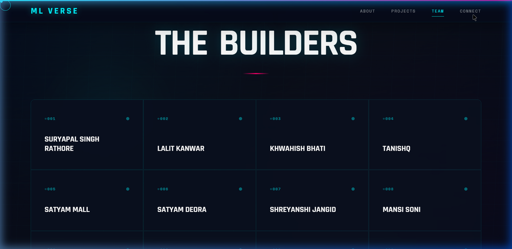
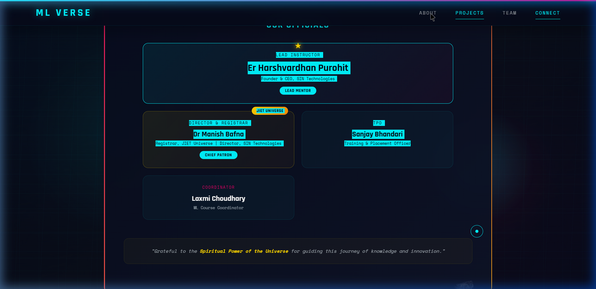

<div align="center">

# 🧠 ML VERSE

### _27 Projects. One Universe._

[](https://mlverse.netlify.app)
[](https://react.dev)
[](https://gsap.com)
[](https://vitejs.dev)
[](https://streamlit.io)

[](https://developer.mozilla.org/en-US/docs/Web/JavaScript)
[](https://www.w3.org/Style/CSS/)
[](https://html.spec.whatwg.org/)
[](https://lenis.darkroom.engineering/)

<br />

> **A sprawling digital ecosystem of 27 specialized Machine Learning projects**, each built with precision and deployed to solve real-world problems. From deep neural networks to advanced clustering algorithms, this universe represents the pinnacle of AI innovation at **SIN School of AI**.

<br />


</div>

---

## ✨ Features

| Feature | Description |
|---------|-------------|
| 🎬 **Cinematic 3D Brain Animation** | 40-frame scroll-synced canvas animation with lerp-based crossfade interpolation |
| 🌊 **Butter-Smooth Scrolling** | Lenis smooth scroll integrated with GSAP ScrollTrigger |
| 🎨 **Glassmorphism UI** | Frosted glass cards with backdrop blur and gradient borders |
| 📊 **27 Live ML Projects** | Real deployed Streamlit applications with search & filter |
| 🧩 **Interactive Builders Grid** | Click any builder to explore their projects |
| ⚡ **GSAP-Powered Animations** | Character-by-character reveals, parallax, counter animations |
| 🖱️ **Custom Cursor** | Cyan-glowing custom cursor with ring follower |
| 📱 **Fully Responsive** | Optimized for desktop, tablet, and mobile |
| 🔗 **Neural Network Background** | Animated particle system with neural connections |

---

## 📸 Screenshots

<div align="center">

### 🏠 Hero Section

<br /><br />

### 📖 About — What is MLVerse?

<br /><br />

### 🚀 Projects Gallery

<br /><br />

### 📊 Stats & Team

<br /><br />

### 👥 The Builders

<br /><br />

### 🤝 Connect — Built at SIN School of AI

<br /><br />

### 🏛️ Our Officials


</div>

---

## 🏛️ Officials & Authorities

<table align="center">
  <tr>
    <td align="center" colspan="2">
      <h3>⭐ Er Harshvardhan Purohit</h3>
      <b>Lead Instructor & Lead Mentor</b><br />
      Founder & CEO, SIN Technologies<br />
      <a href="https://in.linkedin.com/in/harshvardhan1609">LinkedIn</a> · <a href="https://www.instagram.com/ceo.harsh/">Instagram</a>
    </td>
  </tr>
  <tr>
    <td align="center">
      <h4>🏅 Dr Manish Bafna</h4>
      <b>Director & Registrar</b><br />
      Registrar, JIET Universe<br />
      Chief Patron
    </td>
    <td align="center">
      <h4>📋 Sanjay Bhandari</h4>
      <b>TPO</b><br />
      Training & Placement Officer
    </td>
  </tr>
  <tr>
    <td align="center" colspan="2">
      <h4>📘 Laxmi Choudhary</h4>
      <b>Coordinator</b><br />
      ML Course Coordinator
    </td>
  </tr>
</table>

---

## 🛠️ Tech Stack

```
Frontend          React 18 + Vite
Animations        GSAP (ScrollTrigger) + Lenis Smooth Scroll
3D Animation      Canvas API with 40-frame lerp interpolation
Styling           Vanilla CSS with CSS Variables + Glassmorphism
Fonts             Google Fonts (Rajdhani + Space Mono)
ML Projects       Streamlit (Python)
Deployment        Netlify
```

---

## 🚀 Getting Started

### Prerequisites

- **Node.js** v18+ 
- **npm** v8+

### Installation

```bash
# Clone the repository
git clone https://github.com/your-username/mlverse.git
cd mlverse/mlverse/client

# Install dependencies
npm install

# Start development server
npm run dev

# Build for production
npm run build
```

### Deploy to Netlify

```bash
# Option 1: Drag & Drop
# Build → drag the dist/ folder to app.netlify.com/drop

# Option 2: CLI
npm install -g netlify-cli
netlify deploy --prod --dir=dist

# Option 3: Git-based (Auto-deploys)
# Connect your GitHub repo on app.netlify.com
# Base directory: mlverse/client
# Build command: npm run build
# Publish directory: mlverse/client/dist
```

---

## 📁 Project Structure

```
mlverse/client/
├── public/
│   ├── frames/              # 40 brain animation frames (JPG)
│   ├── logo/                # SIN School of AI & JIET logos
│   ├── brain.gif            # Ambient brain decoration
│   └── _redirects           # Netlify SPA routing
├── src/
│   ├── components/
│   │   ├── BrainAnimation.jsx    # Cinematic scroll-synced canvas
│   │   ├── Navbar.jsx            # Smart scroll-tracking navbar
│   │   ├── NeuralBackground.jsx  # Particle neural network
│   │   ├── ProjectCard.jsx       # Glass-morphic project cards
│   │   └── ...
│   ├── sections/
│   │   ├── Hero.jsx         # Landing with 3D title animation
│   │   ├── About.jsx        # Mission & stats
│   │   ├── Projects.jsx     # Filterable project gallery
│   │   ├── Team.jsx         # Interactive builders grid
│   │   ├── Connect.jsx      # Officials & social links
│   │   └── Stats.jsx        # Animated counters
│   ├── data/
│   │   └── projectsData.js  # All 27 project entries
│   ├── App.jsx              # Root with Lenis smooth scroll
│   └── index.css            # Design system & global styles
├── screenshots/             # Application screenshots
└── README.md
```

---

## 🎓 ML Domains Covered

| Domain | Count | Examples |
|--------|-------|---------|
| 🔵 **Clustering** | 8 | TrendCluster AI, ClusterVibe, ClusterVerse |
| 🟢 **Classification** | 4 | Random Forest, Classification |
| 🟡 **Neural Networks** | 7 | Activation Model, NeuralOrbit |
| 🔴 **AI Applications** | 5 | GhostedAI, VibeCheck ML, AIGoverse |
| 🟣 **ML Apps** | 3 | Machine Learning App, Stock Market AI |

---

## 👥 The 27 Builders

<div align="center">

| # | Builder | Project |
|---|---------|---------|
| 01 | Suryapal Singh Rathore | TrendCluster AI |
| 02 | Lalit Kanwar | Random Forest |
| 03 | Khwahish Bhati | Clustering Analysis |
| 04 | Tanishq | Random Forest |
| 05 | Satyam Mall | GhostedAI |
| 06 | Satyam Deora | GhostedAI |
| 07 | Shreyanshi Jangid | ClusterVibe: AI Segmenter |
| 08 | Mansi Soni | Machine Learning App |
| 09 | Ridhima Agarwal | VibeCheck ML |
| 10 | Kritesh Singh Chouhan | Activation Model |
| 11 | Himanshu Bhandari | ClusterVerse |
| 12 | Harish | Random Forest |
| 13 | Nikhil Sharma | ML Acti. Pro. |
| 14 | Mayank Solanki | Learn ML Arctic Ultimate |
| 15 | Aniket Daiya | ML Clustering |
| 16 | Kritesh Singh Chouhan | Learn ML Arctic Ultimate v2 |
| 17 | HarshWardhan Singh Jodha | Clustering Analysis |
| 18 | Arvind Bishnoi | Clustering Analysis |
| 19 | Jaswardhan Solanki | Classification |
| 20 | Priyansh Rai | Activation Dashboard |
| 21 | Su_kumawat (Sunil) | Clustering Dashboard |
| 22 | Anonymous | Activation Functions |
| 23 | Udit Jain | Stock Market AI |
| 24 | Shakti Singh | AIGoverse |
| 25 | Khushal Khatri | NeuralOrbit |
| 26 | Neeti Lohiya | Activation Function |
| 27 | Ritesh Mane | OpenRouter Explorer |

</div>

---

## 🙏 Acknowledgments

- **SIN School of AI** × **JIET Universe** — GEN AI Bootcamp
- **SIN Technologies** — [sintechnologies.in](https://sintechnologies.in)
- **Streamlit** — For making ML deployment accessible
- **GSAP** — For world-class web animations
- The **Spiritual Power of the Universe** for guiding this journey of knowledge and innovation

---

<div align="center">

**© 2025 SIN School of AI · SIN Education & Technology Pvt. Ltd.**

[](https://sintechnologies.in)
[](https://in.linkedin.com/company/sinindia)
[](https://www.instagram.com/sin.edutech/)
[](https://www.youtube.com/@ceoharsh)

<br />

_Machine Learning. Reimagined by Students._ 🚀

</div>
